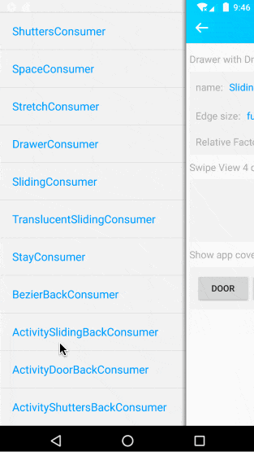
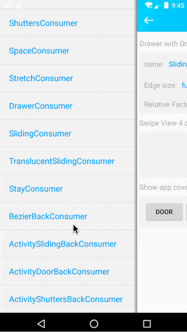

# 关于{{book.name}}
---

**侧滑就选智能侧滑，弹性侧滑、滑动抽屉、下拉刷新、侧滑返回以及侧滑删除等你想到和没想到的，通通搞定。**


库|smart-swipe|smart-swipe-x|smart-swipe-support
:---:|:---:|:---:|:---:
最新版| [](https://bintray.com/hellobilly/android/smart-swipe/_latestVersion)| [](https://bintray.com/hellobilly/android/smart-swipe-x/_latestVersion)| [](https://bintray.com/hellobilly/android/smart-swipe-support/_latestVersion)

为了便于使用，{{book.name}}中还封装了以下工具类：

- [SmartSwipeBack][SmartSwipeBack]: 
	- 全局只需一行代码即可搞定所有Activity侧滑返回
	- 可选样式：开门、百叶窗、仿微信、仿QQ及仿MIUI贝塞尔曲线
	- 无需透明主题
	- 无需继承某个特定的Activity
	- 不需要侵入xml布局文件
	- 也不需要侵入BaseActivity
	- 支持全屏侧滑和(/或)边缘侧滑返回
	- 支持 上/下/左/右 4个方向侧滑返回
- [SmartSwipeRefresh][SmartSwipeRefresh]:
	- 一行代码实现下拉刷新和加载更多
	- 支持纵向和横向
	- 支持自定义刷新控件（跟[scwang90/SmartRefreshLayout](https://github.com/scwang90/SmartRefreshLayout)的自定义刷新控件一样简单，但比它更轻量级）
- [SwipeConsumerExclusiveGroup][SwipeConsumerExclusiveGroup]: <br/>管理一组互斥的SwipeConsumer，同时最多只能打开一个，可用在RecyclerView等列表项中使用


## 演示

弹性拉伸样式<br/>[StretchConsumer][StretchConsumer]|弹性留白样式<br/>[SpaceConsumer][SpaceConsumer]|滑动透明样式<br/>[TranslucentSlidingConsumer][TranslucentSlidingConsumer]
:---:|:---:|:---:
||
在上层显示的滑动抽屉<br/>[DrawerConsumer][DrawerConsumer]|在下层显示的滑动抽屉<br/>(可设置联动系数)<br/>[SlidingConsumer][SlidingConsumer]|
||
开门样式<br/>[DoorConsumer][DoorConsumer]|百叶窗样式<br/>[ShuttersConsumer][ShuttersConsumer]|
||

#### 用于制作封面

开门样式|百叶窗样式|抽屉样式
:---:|:---:|:---:
||


#### 用于实现Activity侧滑返回
无需透明主题，无需继承某个特定的Activity，不需要侵入xml布局文件，也不需要侵入BaseActivity，轻松搞定Activity侧滑返回

仿QQ侧滑返回<br/>[StayConsumer][StayConsumer]|仿微信侧滑返回<br/>[ActivitySlidingBackConsumer][ActivitySlidingBackConsumer]|仿MIUI系统侧滑返回<br/>[BezierBackConsumer][BezierBackConsumer]
:---:|:---:|:---:
||
开门样式<br/>[ActivityDoorBackConsumer][ActivityDoorBackConsumer]|百叶窗样式<br/>[ActivityShuttersBackConsumer][ActivityShuttersBackConsumer]|<font color="blue">全局使用</font><br/>[SmartSwipeBack][SmartSwipeBack]
||


## 使用方式

首先，添加 `SmartSwipe` 依赖到项目中

```groovy
implementation 'com.billy.android:smart-swipe:latestVersion'
```
由于主库未添加任何支持库，仅在android api >= 21(android 5.0以上)时才支持嵌套滑动效果(NestedScrolling)。

如需兼容5.0以下版本嵌套滑动，分别按照如下2种方式来兼容androidX或android support库：

```groovy
implementation 'com.billy.android:smart-swipe:latestVersion'
//android x环境下兼容NestedScrolling
implementation 'com.billy.android:smart-swipe-x:latestVersion'
```

或

```groovy
implementation 'com.billy.android:smart-swipe:latestVersion'
//android support library环境下兼容NestedScrolling
implementation 'com.billy.android:smart-swipe-support:latestVersion'
```

#### 开始使用

{{book.name}}中绝大多少的使用都可以通过链式编程在一行代码内完成，API的设计风格如下：

```java
SmartSwipe.wrap(...) 		//view or Activity
	.addConsumer(...) 		//添加consumer
	.enableDirection(...) 	//指定consumer接收哪个方向的侧滑事件
	.setXxx(...) 			//[可选]一些其它设置项
	.addListener(...); 		//[可选]给consumer添加监听
```
#### 示例代码：
```java
//为控件添加仿MIUI的弹性拉伸效果：
//	当纵向不能滚动（或滚动到顶/底）时，若继续拖动，则UI呈现弹性拉伸效果，释放后平滑恢复
SmartSwipe.wrap(view)
	.addConsumer(new StretchConsumer())
	.enableVertical();
```

#### 可以为同一个View添加多个{{book.baseName}}，按照添加的顺序消费侧滑事件。例如：
```java
SmartSwipe.wrap(view)
	.addConsumer(new StretchConsumer())
	.enableVertical() 					//仿MIUI拉伸效果的方向为：上下2个方向
	.addConsumer(new SpaceConsumer())
	.enableHorizontal() 				//仿iOS弹性留白效果的方向为：左右2个方向
	;
```
每次侧滑，从开始到结束，只有被1个{{book.baseName}}全程消费，谁先捕获到本次侧滑，则接下来的侧滑距离都交给它来消费。

点击[这里][SwipeConsumer]你将了解到：
- 内置的每种{{book.baseName}}的具体用法
- 创建一个属于你的自定义{{book.baseName}}的方法

#### 全局只需一行代码即可搞定所有Activity侧滑返回(5种样式可选)
```java
SmartSwipeBack.activityBezierBack(application, null);	//仿小米MIUI系统的贝塞尔曲线返回效果
SmartSwipeBack.activityStayBack(application, null);		//仿手机QQ的手势滑动返回
SmartSwipeBack.activitySlidingBack(application, null);	//仿微信带联动效果的透明侧滑返回
SmartSwipeBack.activityDoorBack(application, null);		//侧滑开门样式关闭activity
SmartSwipeBack.activityShuttersBack(application, null);	//侧滑百叶窗样式关闭activity
```
详细内容及注意事项请看这里：[全局侧滑返回][SmartSwipeBack]

### 一行代码给View添加下拉刷新功能
```java
//xxxMode第二个参数为false，表示工作方向为纵向：下拉刷新&上拉加载更多
//如果第二个参数设置为true，则表示工作方向为横向：右拉刷新&左拉加载更多
SmartSwipeRefresh.drawerMode(view, false).setDataLoader(loader);
SmartSwipeRefresh.behindMode(view, false).setDataLoader(loader);
SmartSwipeRefresh.scaleMode(view, false).setDataLoader(loader);
SmartSwipeRefresh.translateMode(view, false).setDataLoader(loader);
```
更多关于下拉刷新功能的介绍请查看[下拉刷新][SmartSwipeRefresh], 关于自定义刷新控件请点击[这里][SmartSwipeRefresh-ext]


## {{book.name}}特性：

- 支持上下左右4个方向侧滑
- 支持边缘触发侧滑也支持整个View(或整个Activity)区域内触发侧滑
- 支持给同一个控件添加多个侧滑效果
- 支持在View树的不同层级中嵌套使用
- 支持在ListView及RecyclerView等列表项及列表本身使用
- 支持NestedScroll（支持support和androidX）
- 支持通过代码触发侧滑
- 内置十多种{{book.baseName}}侧滑效果（包括百叶窗、开门、滑动抽屉、下拉刷新、侧滑返回、侧滑删除等等）


{{book.name}}封装了对控件侧滑事件（*上/下/左/右4个方向滑动的手势事件*）的捕获、分发及多点交替滑动的处理，基于{{book.name}}我们可以为控件添加各种你想要的侧滑效果。

主要实现原理及思想来源于android官方支持库中的[ViewDragHelper][ViewDragHelper]，在其基础上，将它对子View的捕获及移动处理改成对父View自身触摸事件的定性（能否及是否捕获）、定向（捕获的事件所触发的侧滑方向）及定位（事件捕获之后在侧滑方向上移动的距离），并交由{{book.baseName}}来完成侧滑事件的具体UI呈现效果

{{book.baseName}}类实现了侧滑事件处理的公共逻辑，通过继承{{book.baseName}}可以自定义各种丰富的侧滑效果。


## {{book.name}}的封装思路：

- 用一个ViewGroup将需要处理侧滑事件的控件View包裹起来，被包裹起来的控件作为它的`contentView`，可以为这个ViewGroup添加一些附属控件View（如：滑动抽屉）
- 拦截这个ViewGroup的touch事件，并将touch事件转换为侧滑距离交给{{book.baseName}}进行消费
- {{book.baseName}}在消费侧滑事件的过程中，对contentView及附属控件的UI呈现（位置、缩放、透明等）进行合理的加工，从而实现各种侧滑的效果。


## 鸣谢

实现侧滑返回功能Activity透明的方案参考了:

- [Android侧滑返回分析和实现（不高仿微信）](https://www.jianshu.com/p/26fac8d30058?from=groupmessage) 源码：[SwipeBackHelper](https://github.com/Simon-Leeeeeeeee/SLWidget/blob/master/swipeback/src/main/java/cn/simonlee/widget/swipeback/SwipeBackHelper.java)
- [ikew0ng/SwipeBackLayout](https://github.com/ikew0ng/SwipeBackLayout)
- [Android 平台滑动返回库对比](https://www.ctolib.com/topics-115598.html)
- [Android版与微信Activity侧滑后退效果完全相同的SwipeBackLayout](https://www.jianshu.com/p/b6d682e301c2)

实现贝塞尔曲线侧滑返回功能时参考了：

- [Blankj/SwipePanel](https://github.com/Blankj/SwipePanel)
- [qinci/AndroidSlideBack](https://github.com/qinci/AndroidSlideBack)

下拉刷新功能参考了[scwang90/SmartRefreshLayout](https://github.com/scwang90/SmartRefreshLayout)部分设计

Demo中的卡通头像均来自: https://www.thiswaifudoesnotexist.net/

Demo中使用icon图片均取自：https://www.iconfont.cn/

Demo中封面使用的图片来源于[回车素材网](https://m.sc.enterdesk.com/sucai/477026.html)（侵删）

Demo中封面使用的下雪效果自定义View拷贝并修改自：[AnliaLee/FallingView](https://github.com/AnliaLee/FallingView)

Demo中首页使用的点赞自定义View直接引用自第三方开源库：[jd-alexander/LikeButton](https://github.com/jd-alexander/LikeButton)

扩展包(smart-swipe-refresh-ext)中的[ArrowHeader](https://github.com/luckybilly/SmartSwipe/blob/master/smart-swipe-refresh-ext/src/main/java/com/billy/android/swipe/ext/refresh/ArrowHeader.java)使用了第三方开源库： [Ifxcyr/ArrowDrawable](https://github.com/Ifxcyr/ArrowDrawable)


[ViewDragHelper]: https://android.googlesource.com/platform/frameworks/support/+/refs/heads/androidx-master-dev/customview/src/main/java/androidx/customview/widget/ViewDragHelper.java
[SwipeConsumer]: /pages/SwipeConsumer.md
[SmartSwipeBack]: /pages/SmartSwipeBack.md
[SmartSwipeRefresh]: /pages/SmartSwipeRefresh.md
[SmartSwipeRefresh-ext]: /pages/SmartSwipeRefresh.md#扩展包：smart-swipe-refresh-ext
[SwipeConsumerExclusiveGroup]: /pages/SwipeConsumerExclusiveGroup.md

[ActivityDoorBackConsumer]: /pages/consumers/ActivityDoorBackConsumer.md
[ActivityShuttersBackConsumer]: /pages/consumers/ActivityShuttersBackConsumer.md
[ActivitySlidingBackConsumer]: /pages/consumers/ActivitySlidingBackConsumer.md
[BezierBackConsumer]: /pages/consumers/BezierBackConsumer.md
[DoorConsumer]: /pages/consumers/DoorConsumer.md
[DrawerConsumer]: /pages/consumers/DrawerConsumer.md
[ShuttersConsumer]: /pages/consumers/ShuttersConsumer.md
[SlidingConsumer]: /pages/consumers/SlidingConsumer.md
[SpaceConsumer]: /pages/consumers/SpaceConsumer.md
[StayConsumer]: /pages/consumers/StayConsumer.md
[StretchConsumer]: /pages/consumers/StretchConsumer.md
[TranslucentSlidingConsumer]: /pages/consumers/TranslucentSlidingConsumer.md

